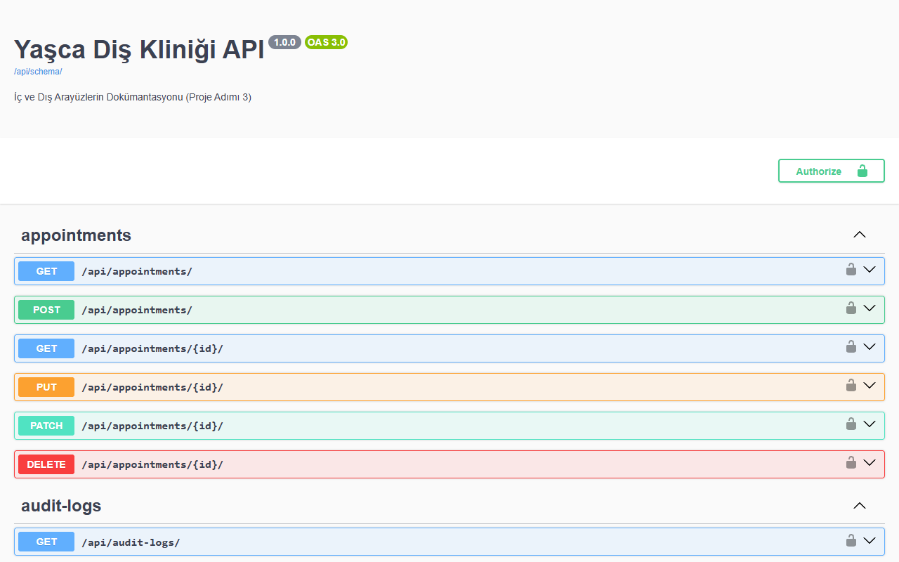

# Yazılım Gerçekleme, Test ve Bakım – Proje Adımı 3

**Proje Adı:** Yaşca Diş Kliniği Yönetim Sistemi
**Grup:** 4
**Grup Üyeleri:** Yaman Halloum, Ali Üre, Cihan Kurtbey, Berkay Aydın

---

## 1. Proje Adımının Amacı
Bu proje adımının amacı, Yaşca Diş Kliniği Yönetim Sistemi projesinin çekirdek yapısının kodlanması, arayüzlerin (Interface) tasarlanıp tanımlanması ve üretilen yapının kalitesinin analiz edilmesidir. 

## 2. Kapsam, Girdiler ve Adım 1-2 Bağlantısı
Bu aşamada Proje Adımı 1'deki UML Sınıf ve Sekans diyagramları ile Proje Adımı 2'deki teknoloji seçimi (Django REST Framework) baz alınmıştır.
- **Sınıf Diyagramı Bağlantısı:** Adım 1'de tasarlanan `Clinic`, `Patient` ve `Appointment` sınıfları arasındaki "1..*" (Bire-Çok) ilişkiler, ORM (Object-Relational Mapping) katmanında `ForeignKey` yapılarıyla kodlanmıştır.
- **Sekans Diyagramı Bağlantısı:** Adım 1'de modellenen `createAppointment(payload)` mesajı, backend'de `AppointmentViewSet` sınıfı üzerinden karşılanarak `AppointmentSerializer`'ın `validate()` metodundaki iş kurallarına tabi tutulmuştur.

## 3. Opsiyon Seçimi ve Gerekçesi
**Seçilen Opsiyon:** Opsiyon A (İç ve Dış Arayüzlerin Gerçeklenmesi ve Dokümantasyonu)
**Gerekçe:** "Yaşca Diş Kliniği Yönetim Sistemi", React.js (Frontend) ve Django REST Framework (Backend) kullanılarak geliştirilen API odaklı (API-first) bir SaaS projesidir. Sistemde yoğun bir arayüz/entegrasyon mimarisi bulunduğu için iç ve dış arayüzlerin detaylı kontratlarının tanımlanması ve OpenAPI (Swagger) ile dokümante edilmesi seçilmiştir.

---

## 4. Gerçeklenen İç Arayüzler (Internal Interfaces)

Projedeki katmanlar (Model, ViewSet, Serializer) birbirleriyle JSON paketleri üzerinden haberleşmektedir. Endüstri standardı olan **Swagger (drf-spectacular)** kullanılarak tüm API uç noktaları canlı olarak dokümante edilmiştir.

### 4.1. Swagger Ekran Görüntüsü
*(Aşağıdaki görsel, backend sunucumuzun çalışırken ürettiği canlı Swagger dokümantasyonudur.)*



### 4.2. API Endpoint Kontratları ve Hata Kodları

#### A. Kimlik Doğrulama: `POST /api/auth/token/`
- **Açıklama:** Sisteme giriş yapılarak yetki jetonu (JWT) alınması.
- **Request Body:** `{"username": "admin_user", "password": "securepassword123"}`
- **Response Body (200 OK):** `{"access": "eyJhbGciOi...", "refresh": "eyJhbGciOi..."}`
- **Hata Kodları:** `401 Unauthorized` (Hatalı giriş), `400 Bad Request` (Eksik parametre).

#### B. Hasta Yönetimi: `GET` & `POST /api/patients/`
- **Açıklama:** Sisteme yeni hasta kaydı yapılması ve listelenmesi (FR-02).
- **POST Request Body:**
  ```json
  {
    "first_name": "Ahmet",
    "last_name": "Yılmaz",
    "phone": "05551234567"
  }
  ```
- **GET Response Örneği (200 OK):**
  ```json
  [
    {
      "id": 1,
      "first_name": "Ahmet",
      "last_name": "Yılmaz",
      "full_name": "Ahmet Yılmaz",
      "phone": "05551234567",
      "tckn": null,
      "last_visit": "2026-05-20"
    }
  ]
  ```
- **Hata Kodları:** `400 Bad Request` (Zorunlu alan eksik).

#### C. Randevu Yönetimi: `POST /api/appointments/`
- **Açıklama:** Çakışma kontrollü yeni randevu oluşturulması (FR-03).
- **Request Body:** `{"patient": 15, "doctor": 3, "date": "2026-06-15", "time": "14:30:00"}`
- **Response Body (201 Created):** Başarıyla oluşturulan randevu nesnesi (`id: 42`).
- **Hata Kodları:** `400 Bad Request` (Çakışma - Conflict), `403 Forbidden` (Yetkisiz).

#### D. Günlük Özet (Dashboard): `GET /api/dashboard/today/`
- **Açıklama:** Ana ekranda gösterilecek günlük aktif randevular, tamamlanan işlemler ve toplam hasta sayısı verilerini tek bir uç noktadan döner (FR-04). Bu uç nokta, uygulamanın performansı için kritik olan özet veriyi (Aggregation) backend tarafında hesaplayarak frontend'e tek seferde sunar.
- **Response Body (200 OK):**
  ```json
  {
    "today_appointments": [...],
    "today_total": 12,
    "today_completed": 4,
    "total_patients": 150
  }
  ```

---

## 5. Gerçek Kod Örnekleri

Raporun bu bölümünde, uygulamanın çekirdek mimarisinden alınan gerçek Python (Django REST Framework) kod blokları sunulmuştur. 

### 5.1. Model Katmanı (Entity)
`Appointment` modeli (`api/models.py`):
```python
class Appointment(models.Model):
    class Status(models.TextChoices):
        SCHEDULED = "scheduled", "Planlandı"
        COMPLETED = "completed", "Tamamlandı"

    patient = models.ForeignKey(Patient, on_delete=models.CASCADE, related_name="appointments")
    doctor = models.ForeignKey(CustomUser, on_delete=models.PROTECT)
    date = models.DateField("Tarih")
    time = models.TimeField("Saat")
    status = models.CharField(max_length=20, choices=Status.choices, default=Status.SCHEDULED)
```

### 5.2. Serializer Katmanı ve Çakışma Algoritması (Control)
Hekimin aynı saatte başka bir randevusu varsa algoritma `400` hatası fırlatır:
```python
class AppointmentSerializer(serializers.ModelSerializer):
    def validate(self, data):
        # FR-03: Aynı hekime aynı saatte randevu çakışması kontrolü
        doctor, date, time = data.get("doctor"), data.get("date"), data.get("time")
        existing = Appointment.objects.filter(
            doctor=doctor, date=date, time=time, status=Appointment.Status.SCHEDULED
        )
        if existing.exists():
            raise serializers.ValidationError("Bu hekime bu saatte zaten randevu kayıtlı.")
        return data
```

### 5.3. ViewSet Katmanı (Controller)
Gelen isteklerin karşılandığı, filtreleme ve silme mantığının (business logic) yönetildiği sınıf:
```python
class AppointmentViewSet(AuditLogMixin, viewsets.ModelViewSet):
    permission_classes = [IsAuthenticated]
    
    def get_serializer_class(self):
        if self.action in ("create", "update"):
            return AppointmentCreateSerializer
        return AppointmentSerializer

    def get_queryset(self):
        user = self.request.user
        qs = Appointment.objects.filter(is_active=True).select_related("patient", "doctor")
        if user.role == CustomUser.Role.DOCTOR and not user.is_superuser:
            qs = qs.filter(doctor=user)
        return qs.order_by("date", "time")
```

---

## 6. Dış Arayüzler (External Interfaces) ve Multi-Tenant Altyapı

### 6.1. Harici SMS Sağlayıcı Entegrasyonu
- **Senaryo:** Randevu oluşturulduğunda API'ye istek atar.
- **Dış Kontrat (Payload):** `{"api_key": "YOUR_SECRET_KEY", "phone_number": "+905551234567", "message": "Randevunuz onaylanmıştır."}`
- **Hata Yönetimi (Exception Handling):** Dış API yanıt vermezse (Timeout), işlem çökmez. Hata, log sistemimize kaydedilir ve randevu asenkron olarak tamamlanır.

### 6.2. Frontend (React) Entegrasyonu
Frontend uygulaması, sunucu ile `axios` kullanarak haberleşmektedir. JWT (Bearer Token) otomatik olarak başlığa (Header) eklenir. Örnek API çağrısı:
```javascript
// frontend/src/services/api.js
import axios from 'axios';

const api = axios.create({ baseURL: 'http://127.0.0.1:8000/api/' });

api.interceptors.request.use((config) => {
    const token = localStorage.getItem('accessToken');
    if (token) config.headers.Authorization = `Bearer ${token}`;
    return config;
});

export const fetchDashboardData = async () => {
    const response = await api.get('/dashboard/today/');
    return response.data;
};
```

### 6.3. Multi-Tenant (SaaS) Mimarisi
Uygulama `django-tenants` kütüphanesi kullanılarak çoklu kiracı yapısında kodlanmıştır. `HeaderTenantMiddleware`, HTTP Request içerisindeki domain/tenant kimliğini okur ve PostgreSQL şemasını o kliniğe yönlendirir. Böylece veri güvenliği fiziksel izolasyonla sağlanır.
